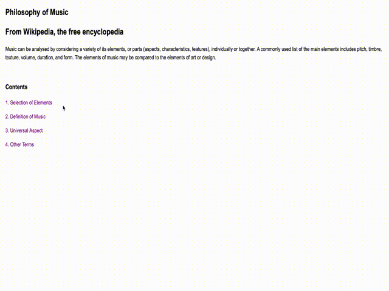

# Basic WebBook: Philosophy of Music

Philosophy of Music is a basic web-book created using HTML/CSS that goes over the basics concerning the philosophy of music.

## Demo

The demo below goes over some of the basic functionality of the web-book.

